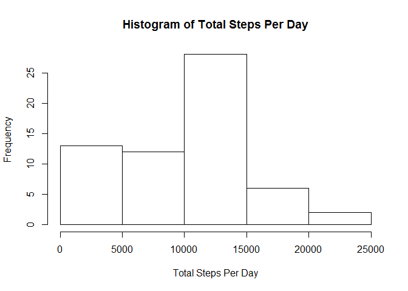
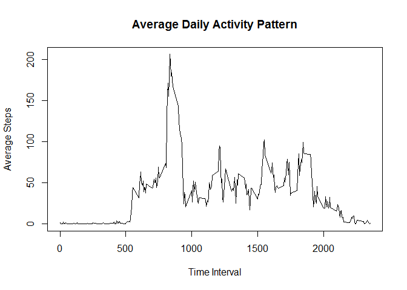
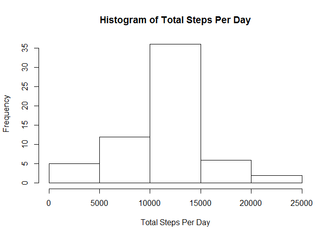
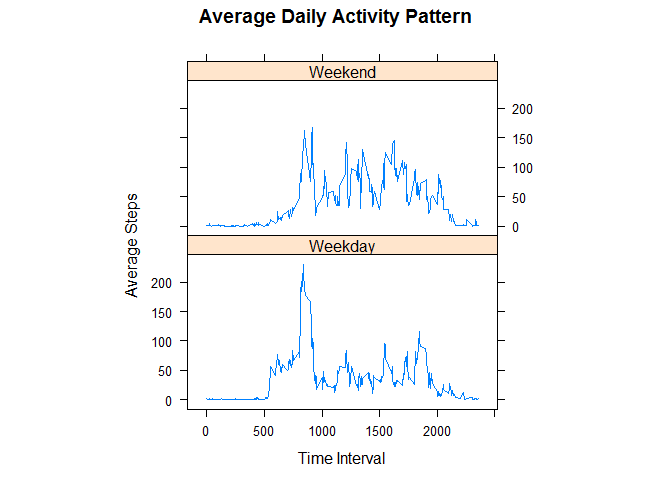

# Reproducible Research: Peer Assessment 1


## Loading and preprocessing the data

Load the data and Process/transform the data (if necessary) into a format suitable for your analysis

```r
d <- read.csv("activity.csv")
```

## What is mean total number of steps taken per day?


Calculate the total number of steps taken per day

```r
DailyTotal <- aggregate(d$steps, by=list(d$date), FUN=sum, na.rm = TRUE)
names(DailyTotal) <- c("Date", "TotalSteps")

DailyTotal
```

```
##          Date TotalSteps
## 1  2012-10-01          0
## 2  2012-10-02        126
## 3  2012-10-03      11352
## 4  2012-10-04      12116
## 5  2012-10-05      13294
## 6  2012-10-06      15420
## 7  2012-10-07      11015
## 8  2012-10-08          0
## 9  2012-10-09      12811
## 10 2012-10-10       9900
## 11 2012-10-11      10304
## 12 2012-10-12      17382
## 13 2012-10-13      12426
## 14 2012-10-14      15098
## 15 2012-10-15      10139
## 16 2012-10-16      15084
## 17 2012-10-17      13452
## 18 2012-10-18      10056
## 19 2012-10-19      11829
## 20 2012-10-20      10395
## 21 2012-10-21       8821
## 22 2012-10-22      13460
## 23 2012-10-23       8918
## 24 2012-10-24       8355
## 25 2012-10-25       2492
## 26 2012-10-26       6778
## 27 2012-10-27      10119
## 28 2012-10-28      11458
## 29 2012-10-29       5018
## 30 2012-10-30       9819
## 31 2012-10-31      15414
## 32 2012-11-01          0
## 33 2012-11-02      10600
## 34 2012-11-03      10571
## 35 2012-11-04          0
## 36 2012-11-05      10439
## 37 2012-11-06       8334
## 38 2012-11-07      12883
## 39 2012-11-08       3219
## 40 2012-11-09          0
## 41 2012-11-10          0
## 42 2012-11-11      12608
## 43 2012-11-12      10765
## 44 2012-11-13       7336
## 45 2012-11-14          0
## 46 2012-11-15         41
## 47 2012-11-16       5441
## 48 2012-11-17      14339
## 49 2012-11-18      15110
## 50 2012-11-19       8841
## 51 2012-11-20       4472
## 52 2012-11-21      12787
## 53 2012-11-22      20427
## 54 2012-11-23      21194
## 55 2012-11-24      14478
## 56 2012-11-25      11834
## 57 2012-11-26      11162
## 58 2012-11-27      13646
## 59 2012-11-28      10183
## 60 2012-11-29       7047
## 61 2012-11-30          0
```


Make a histogram of the total number of steps taken each day


```r
hist(DailyTotal$TotalSteps, xlab="Total Steps Per Day", main="Histogram of Total Steps Per Day") 
```

<!-- -->


mean and median of the total number of steps taken per day


```r
mean(DailyTotal$TotalSteps)
```

```
## [1] 9354.23
```

```r
median(DailyTotal$TotalSteps)
```

```
## [1] 10395
```


## What is the average daily activity pattern?

Make a time series plot (i.e. type = "l") of the 5-minute interval (x-axis) and the average number of steps taken, averaged across all days (y-axis)

```r
IntervalMean <- aggregate(d$steps, by=list(d$interval), FUN=mean, na.rm = TRUE)
names(IntervalMean) <- c("Interval", "Mean")

plot(IntervalMean$Interval, IntervalMean$Mean, type="l", main="Average Daily Activity Pattern", xlab="Time Interval", ylab="Average Steps") 
```

<!-- -->


Which 5-minute interval, on average across all the days in the dataset, contains the maximum number of steps?

```r
IntervalMean[which.max(IntervalMean$Mean), ]
```

```
##     Interval     Mean
## 104      835 206.1698
```


## Imputing missing values
total number of missing values:

```r
nrow(d[!complete.cases(d),])
```

```
## [1] 2304
```


Devise a strategy for filling in all of the missing values in the dataset. The strategy does not need to be sophisticated. For example, you could use the mean/median for that day, or the mean for that 5-minute interval, etc.

Create a new dataset that is equal to the original dataset but with the missing data filled in.

```r
newdata <- d

interval2steps <- function(interval) {
    IntervalMean[IntervalMean$Interval == interval, ]$Mean
}


for (i in 1:nrow(newdata)){
      if (is.na(newdata[i, ]$steps)){
        newdata[i, ]$steps <- interval2steps(newdata[i, ]$interval)
    }
}


DailyTotal2 <- aggregate(newdata$steps, by=list(newdata$date), FUN=sum, na.rm = TRUE)
names(DailyTotal2) <- c("Date", "TotalSteps")
```

Make a histogram of the total number of steps taken each day and Calculate and report the mean and median total number of steps taken per day. Do these values differ from the estimates from the first part of the assignment? What is the impact of imputing missing data on the estimates of the total daily number of steps?


```r
hist(DailyTotal2$TotalSteps, xlab="Total Steps Per Day", main="Histogram of Total Steps Per Day") 
```

<!-- -->

```r
mean(DailyTotal2$TotalSteps)
```

```
## [1] 10766.19
```

```r
median(DailyTotal2$TotalSteps)
```

```
## [1] 10766.19
```

## Are there differences in activity patterns between weekdays and weekends?


Create a new factor variable in the dataset with two levels -- "weekday" and "weekend" indicating whether a given date is a weekday or weekend day.

```r
day<-newdata$date
newdata<-cbind(newdata,day)
newdata$day<-weekdays(as.Date(newdata$date))

newdata$day<-gsub("Monday", "Weekday",newdata$day)
newdata$day<-gsub("Tuesday", "Weekday",newdata$day)
newdata$day<-gsub("Wednesday", "Weekday",newdata$day)
newdata$day<-gsub("Thursday", "Weekday",newdata$day)
newdata$day<-gsub("Friday", "Weekday",newdata$day)
newdata$day<-gsub("Saturday", "Weekend",newdata$day)
newdata$day<-gsub("Sunday", "Weekend",newdata$day)

IntervalMean2 <- aggregate(newdata$steps, by=list(newdata$day, newdata$interval), FUN=mean)


names(IntervalMean2) <- c("Day", "Interval", "Mean")
```

Make a panel plot containing a time series plot (i.e. type = "l") of the 5-minute interval (x-axis) and the average number of steps taken, averaged across all weekday days or weekend days (y-axis). The plot should look something like the following, which was created using simulated data:


```r
library(lattice)
xyplot(Mean ~ Interval | factor(Day), data = IntervalMean2, aspect = 1/2, 
    type = "l",  main="Average Daily Activity Pattern", xlab="Time Interval", ylab="Average Steps")
```

<!-- -->
